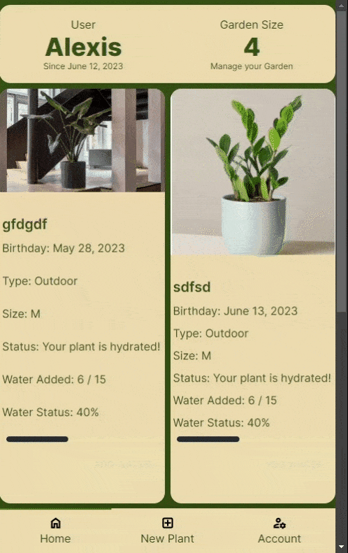

# Next Dynamo PlantHub: Plant Identification and Care Application

Next Dynamo PlantHub is a user-friendly and comprehensive plant identification and care application designed to help gardening enthusiasts manage their plants effectively. The real fun, was developing an application centered around the user experience.
  

## Table of Contents

1. [The User Experience at Heart](#the-user-experience-at-heart)
2. [Key Features](#key-features)
3. [Technologies Learned](#technologies-learned)
4. [PlantHub Refactor: Lessons Learned](#planthub-refactor-lessons-learned)
5. [Future Developments](#future-developments)

## The User Experience at Heart

To create a seamless and enjoyable user experience, Next Dynamo PlantHub prioritizes several key aspects:

- **Direct Access to Garden**: Upon logging in, users are immediately directed to their garden. This ensures a smooth and efficient user journey, allowing them to quickly access and manage their plants without unnecessary navigation steps.

- **Real-Time Image Upload**: Next Dynamo PlantHub provides users with the ability to upload images of their plants in real time with just a few clicks. This feature enhances convenience and allows users to capture and document their plants' progress effortlessly.

- **Visual Representation of Plants**: A key focus of Next Dynamo PlantHub is to provide users with a visually appealing representation of their plants. By displaying plant images prominently and ensuring minimal user errors in the identification process, users can easily identify and interact with their plants.

## Key Features

- **AI Plant Recognition**: Next Dynamo PlantHub utilizes cutting-edge artificial intelligence technology to identify plants accurately. Simply take a photo of a plant, and Next Dynamo PlantHub will provide you with instant information about the species, including its common name, scientific name, and care instructions.

- **Daily User Synchronization**: Next Dynamo PlantHub allows users to synchronize their gardening activities across multiple devices seamlessly. Update your plant care schedule, water your plants, and see your updates on the cloud daily.

- **Responsive and Interactive User Interface**: The user interface of Next Dynamo PlantHub is designed to be intuitive and visually appealing. Enjoy a seamless and enjoyable user experience while navigating through the app's features, application theme options, accessing plant profiles, and managing your garden effortlessly.

- **Mobile Friendly and Progressive Web Application (PWA)**: Next Dynamo PlantHub is built as a Progressive Web Application, ensuring it works seamlessly across different devices and platforms. Install it on your mobile device's home screen like a native app and access it with an app-like experience.

- **Integration of DynamoDB and Amazon S3**: Next Dynamo PlantHub leverages the power of DynamoDB and Amazon S3 for secure and efficient data storage. Your plant collection, care schedules, and other important information are stored safely, ensuring reliability and scalability.

## Technologies Learned

- **Next.js Configuration and Routes**: Throughout the development of Next Dynamo PlantHub, I gained valuable experience in configuring a Next.js project and setting up routes for different pages and API routes. This allowed for efficient navigation and seamless user experience within the application.

- **Integration with next-auth**: To provide secure authentication and session management, I successfully integrated the `next-auth` library into Next Dynamo PlantHub. This integration ensured that user data and interactions are protected, and users can securely access their personalized garden and settings.

- **Working with TypeScript**: Next Dynamo PlantHub was developed using TypeScript, a statically-typed superset of JavaScript. Leveraging TypeScript allowed for better code maintainability and reduced runtime errors, thanks to its strong typing system and advanced type-checking capabilities.

- **AWS DynamoDB Integration**: I integrated AWS DynamoDB into Next Dynamo PlantHub for efficient data storage and management. DynamoDB's flexibility, scalability, and performance made it an ideal choice for handling dynamic data related to plants and users within the application.

- **Optimizing Image Storage with AWS S3**: In Next Dynamo PlantHub, I utilized AWS S3 (Simple Storage Service) to optimize image storage and management. By implementing front-end techniques to minimize image size, I ensured optimal storage utilization and faster loading times for the application.

- **IndexedDB (IDB) Integration**: To provide offline functionality and a responsive user interface, I integrated IndexedDB (IDB) into Next Dynamo PlantHub. IDB allowed for data caching and synchronization, enabling users to continue using the application even when offline.

- **Tailwind CSS and DaisyUI**: Next Dynamo PlantHub's user interface was styled using Tailwind CSS along with the DaisyUI plugin. This combination provided a powerful and flexible styling framework, allowing for responsive design and efficient theming options.

- **Independent Development, Testing, and Deployment**: Next Dynamo PlantHub was developed, tested, and deployed independently, showcasing my ability to handle the entire development cycle. From coding to testing and deployment, I took full ownership of the project without external assistance.

## PlantHub Refactor: Lessons Learned

In the previous project, PlantHub Refactor, I encountered several challenges that hindered the desired user experience. Some of the issues included:

- **Useless Homepage**: The homepage of PlantHub Refactor did not provide any meaningful information or functionality, which led to a disjointed user experience. Users had to navigate through unnecessary pages before reaching their garden, causing frustration.

- **Unintuitive Mobile UI**: The mobile user interface of PlantHub Refactor lacked clarity and intuitiveness. It was unclear where to find the login page, navigate to different sections, and overall, the app lacked a logical flow. This resulted in a frustrating user experience and hindered the app's usability.

- **Incomplete Features**: PlantHub Refactor had incomplete features, making it difficult for users to fully utilize the application's capabilities. This resulted in a subpar user experience and limited functionality.

- **Poorly Managed Codebase**: The codebase of PlantHub Refactor was poorly organized and managed, making it challenging to implement improvements and address issues effectively. This hindered the ability to enhance the user experience and introduce new features seamlessly.

To overcome these limitations and provide an exceptional user experience, I made the decision to recreate Next Dynamo PlantHub from the ground up. By starting afresh and incorporating valuable lessons learned, I was able to build a more intuitive, feature-rich, and user-friendly application.

## Future Developments

In the future, Next Dynamo PlantHub aims to provide even more functionality and features to enhance the gardening experience. Some of the planned developments include:

- **Plant Deletion**: Users will have the ability to remove plants from their collection within the app. This feature will allow for easy management and organization of the garden as per the user's preferences.

- **Social Sharing**: Next Dynamo PlantHub plans to integrate social sharing capabilities, enabling users to share their plant collection, gardening achievements, and knowledge with friends and fellow gardening enthusiasts.

- **Enhanced Plant Care Tips**: Next Dynamo PlantHub will expand its database of plant care tips and recommendations, providing users with a vast library of resources to ensure the healthy growth and maintenance of their plants.

- **Community Engagement**: Next Dynamo PlantHub envisions building a thriving community of plant lovers where users can connect, share experiences, seek advice, and participate in discussions related to gardening and plant care.

Next Dynamo PlantHub is continuously evolving and committed to delivering a top-notch gardening experience to its users. With its AI-driven plant identification, synchronization capabilities, responsive interface, and integration with powerful data storage solutions, Next Dynamo PlantHub sets the stage for a seamless and enjoyable gardening journey.

